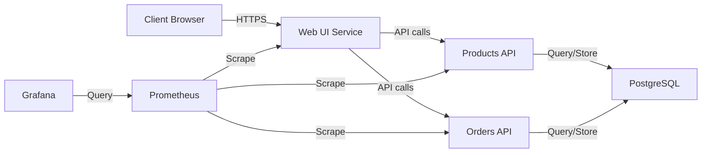

# Homelab 🏠

A complete homelab infrastructure management system using Terraform, Ansible, and K3s for Kubernetes orchestration.

## Overview

This project provides a full infrastructure-as-code solution for managing a homelab environment. It leverages:

- **Terraform** for infrastructure provisioning
- **Ansible** for configuration management
- **K3s** as a lightweight Kubernetes distribution

## Architecture

```
┌─────────────────────────────────┐      ┌─────────────────┐
│           Client Device         │      │   DNS Server    │
└───────────────┬─────────────────┘      └────────┬────────┘
                │                                  │
                ▼                                  ▼
         ┌──────────────┐               ┌──────────────────┐
         │  Ingress     │◄──────────────┤ TLS Certificates │
         │  Controller  │               └──────────────────┘
         └───────┬──────┘
                 │
     ┌───────────┼────────────┬─────────────────┐
     │           │            │                 │
     ▼           ▼            ▼                 ▼
┌─────────┐ ┌─────────┐ ┌──────────┐     ┌────────────┐
│ Web UI  │ │Products │ │ Orders   │     │ Monitoring │
│ Service │ │ API     │ │ API      │     │ Stack      │
└────┬────┘ └────┬────┘ └────┬─────┘     └─────┬──────┘
     │           │           │                  │
     │           └─────┬─────┘                  │
     │                 ▼                        │
     │          ┌────────────┐                 │
     └──────────► PostgreSQL ◄─────────────────┘
                └────────────┘
```

## Components

### Terraform Modules

- **kubernetes_base**: Core Kubernetes infrastructure setup
- **storage**: Persistent volume management for Kubernetes
- **networking**: Network configuration including ingress controllers
- **security**: Security implementations like cert-manager and network policies
- **databases**: Database services including PostgreSQL
- **microservices**: Microservices deployment with ingress configuration

### Ansible Components

Automates server configuration and K3s deployment across the cluster.

## Prerequisites

- Terraform v1.0+
- Ansible v2.10+
- Linux/Unix-based systems for hosting K3s
- SSH access to all target machines
- Sufficient hardware resources (CPU/RAM/Storage)
  - **Minimum requirements**: 2 CPU cores, 4GB RAM, 20GB storage per node
  - **Recommended**: 4+ CPU cores, 8GB+ RAM, 50GB+ SSD storage

## Installation

### Initial Setup

1. Clone the repository:

   ```bash
   git clone https://github.com/felipecarlos/homelab.git
   cd homelab
   ```

2. Configure Terraform variables:

   ```bash
   cp infrastructure/terraform/terraform.tfvars.example infrastructure/terraform/terraform.tfvars
   # Edit the terraform.tfvars file with your specific configuration
   ```

3. Set up Ansible inventory:

   ```bash
   cp ansible/inventory/hosts.example ansible/inventory/hosts
   # Edit the hosts file with your server details
   ```

### Deployment

1. Initialize and deploy infrastructure with Terraform:

   ```bash
   # Option 1: Manual initialization
   cd infrastructure/terraform
   terraform init
   terraform plan
   terraform apply
   
   # Option 2: Using the initialization script
   ./infrastructure/terraform/terraform-init.sh [environment]
   ```

2. Configure servers with Ansible:

   ```bash
   cd ansible
   ansible-playbook main.yml
   
   # To configure a basic homelab server
   ansible-playbook playbooks/site.yml
   ```

## Project Structure

```
homelab/
├── .gitignore                  # Git ignore patterns
├── README.md                   # This file
├── apps/                       # Application source code
│   ├── homelabshop/            # E-commerce frontend (React)
│   │   ├── public/             # Public assets
│   │   ├── src/                # Source code
│   │   │   ├── components/     # React components
│   │   │   ├── pages/          # Page components
│   │   │   └── App.js          # Main application component
│   ├── products-api/           # Products microservice (Python)
│   │   └── app.py              # Flask API for product management
│   ├── orders-api/             # Orders microservice (Python)
│   │   └── app.py              # Flask API for order management
│   └── setup-apps.sh           # Script to build and deploy applications
├── infrastructure/             # Infrastructure as code
│   ├── ansible/                # Ansible configuration
│   │   ├── inventory/          # Server inventory
│   │   │   ├── group_vars/     # Group-specific variables
│   │   │   └── host_vars/      # Host-specific variables
│   │   ├── roles/              # Ansible roles
│   │   └── playbooks/          # Specific playbooks
│   │       └── site.yml        # Base server setup playbook
│   └── terraform/              # Terraform configuration
│       ├── main.tf             # Main configuration file
│       ├── variables.tf        # Variable definitions
│       ├── terraform-init.sh   # Terraform initialization script
│       ├── environments/       # Environment-specific configs
│       │   └── local/          # Local environment configuration
│       └── modules/            # Terraform modules
│           ├── kubernetes_base/ # K3s base setup
│           ├── storage/        # Persistent volume management
│           ├── networking/     # Network and ingress configuration
│           ├── security/       # Security configurations
│           ├── databases/      # Database services
│           │   └── templates/  # Database configuration templates
│           ├── monitoring/     # Monitoring stack
│           │   ├── templates/  # Dashboard configurations
│           │   │   ├── microservices-dashboard.json  # Microservices dashboard
│           │   │   ├── kubernetes-pods-dashboard.json # Kubernetes pods dashboard
│           │   │   └── node-exporter-dashboard.json  # Node metrics dashboard
│           └── microservices/  # Microservices deployment
│               ├── templates/  # Microservices configuration templates
│               └── main.tf     # Microservices deployment configuration
```

## Running Tests

To run the tests for the applications in this project:

### E-commerce Web App Tests:

```bash
cd apps/homelabshop
npm test
```

This will run the React testing suite using Jest and React Testing Library.

### API Tests:

```bash
cd apps/products-api
python -m pytest

cd apps/orders-api
python -m pytest
```

## Deployment Environments

This project supports multiple deployment environments:

### Local Environment
- Uses K3s on local machines
- Perfect for development and testing
- Low resource requirements
- Setup: `./infrastructure/terraform/terraform-init.sh local`

### AWS Environment
- Production-ready environment using EKS
- Supports auto-scaling and high availability
- Requires AWS credentials configuration
- Setup: `./infrastructure/terraform/terraform-init.sh aws`

## Microservices Relationships



## Deployed Services

### Microservices
- **E-commerce Web**: Frontend application 
  - Deployment: 2 replicas
  - Resource limits: 300m CPU, 256Mi memory
  - URL: https://shop.homelab.local
  
- **Products API**: Product management service
  - Deployment: 2 replicas with Prometheus metrics enabled
  - Resource limits: 500m CPU, 512Mi memory
  - Internal endpoint: http://products-api:8080
  
- **Orders API**: Order processing service
  - Deployment: 2 replicas with Prometheus metrics enabled
  - Resource limits: Custom resource configuration
  - Internal endpoint: http://orders-api:8080

### Database
- **PostgreSQL 15.3**: Main database server
  - Database: ecommerce
  - Custom configuration: pg_stat_statements enabled, max_connections=100
  - Resource limits: 500m CPU, 512Mi memory
  - Persistent storage: 5Gi

### Monitoring Stack
- **Prometheus**: Metrics collection and storage
  - URL: https://prometheus.homelab.local
  - Custom dashboards for microservices monitoring
  
- **Grafana**: Metrics visualization
  - URL: https://grafana.homelab.local
  - Default credentials: admin/homelab-admin
  - Pre-configured dashboards:
    - Microservices metrics
    - Kubernetes pods monitoring
    - Node exporter statistics

## Usage

### Terraform Management

Apply changes to specific modules:

```bash
terraform apply -target=module.storage

# For environment-specific deployment
./terraform-init.sh production
```

### Ansible Operations

Run specific tasks:

```bash
ansible-playbook playbooks/upgrade-k3s.yml

# Deploy base homelab server
ansible-playbook playbooks/site.yml
```

### K3s Cluster Management

Access your Kubernetes cluster:

```bash
export KUBECONFIG=/path/to/kubeconfig.yaml
kubectl get nodes
```

### Database Management

The databases module provides PostgreSQL deployment with:

- Resource limits configuration
- Custom environment variables
- User and database setup
- Version selection (currently using PostgreSQL 15.3)

Example configuration can be found in `infrastructure/terraform/modules/databases/templates/postgresql-values.yaml`.

### Microservices Configuration

The microservices module includes:

- Ingress controller configuration with automatic TLS certificate management
- HTTP connection upgrade support
- Service monitors for Prometheus metrics collection
- Inter-service communication via namespace-level network policies

## Configuration

Key configuration files:

- `infrastructure/terraform/variables.tf`: Define infrastructure variables
- `ansible/inventory/group_vars/`: Group-specific variables
- `ansible/inventory/host_vars/`: Host-specific variables
- `infrastructure/terraform/modules/databases/templates/`: Database templates
- `infrastructure/terraform/modules/microservices/templates/`: Microservices templates

## Maintenance

### System Updates

Regular maintenance tasks:

```bash
# Update K3s version
ansible-playbook playbooks/upgrade-k3s.yml

# Backup all persistent data 
./scripts/backup-data.sh

# Update Terraform modules
terraform init -upgrade
```

### Application Updates

To update the applications:

1. Build new application versions:
   ```bash
   cd apps/
   ./setup-apps.sh build
   ```

2. Deploy updated applications:
   ```bash
   ./setup-apps.sh deploy
   ```

## Troubleshooting

Common issues:

- Terraform state lock: `terraform force-unlock <ID>`
- Ansible connectivity: Check SSH keys and network connectivity
- K3s issues: Check logs with `journalctl -u k3s`
- Environment selection: Ensure using the correct environment with terraform-init.sh
- DNS resolution: Add entries to your /etc/hosts file for local domains

## Backup & Recovery

Backup strategies:

- Terraform: Regular state backup
- K3s: Etcd backup and snapshot management
- Data: Persistent volume backups
- PostgreSQL: Database dumps and volume backups

## Security Notes

- Sensitive values are stored in vault files
- Credentials are never committed to Git
- Regular updates are applied to all components
- SSH root login and password authentication disabled by default
- UFW firewall automatically configured
- Network policies restrict pod-to-pod communication

## Contributing

Contributions are welcome! To contribute to this project:

1. Fork the repository
2. Create a feature branch: `git checkout -b feature/my-feature`
3. Commit your changes: `git commit -am 'Add new feature'`
4. Push to the branch: `git push origin feature/my-feature`
5. Submit a pull request

Please make sure to update tests and documentation as appropriate.

## Frequently Asked Questions

### General Questions
- **Q: Is this suitable for production use?**  
  A: While the system is designed to be robust, it's primarily intended for homelab environments.

- **Q: What's the minimum number of nodes required?**  
  A: You can run the system on a single node, but 3 nodes are recommended for high availability.

### Technical Questions
- **Q: How do I add a new microservice?**  
  A: Create a new service directory in the `apps/` folder and add its deployment in `infrastructure/terraform/modules/microservices/main.tf`.

- **Q: Can I use a different database system?**  
  A: Yes, modify the `databases` module to deploy your preferred database.

## License

This project is licensed under the MIT License - see the LICENSE file for details.

